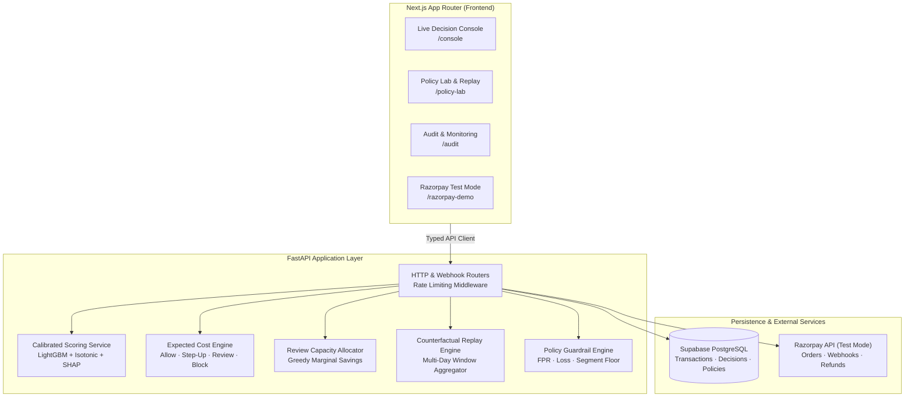
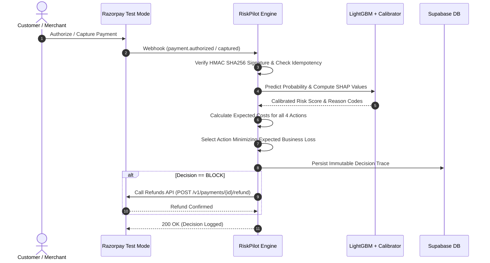
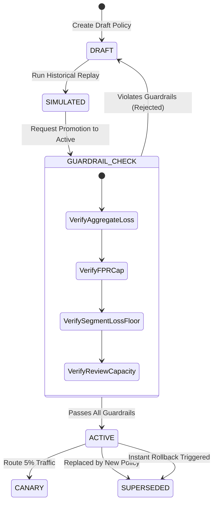

<div align="center">

# RiskPilot

RiskPilot transforms raw fraud probabilities into **cost-minimizing, capacity-aware payment decisions** (Allow, Step-Up, Review, Block). Simulate counterfactual policy changes against historical traffic with strict guardrails, dynamically allocate human review capacity, and enforce post-capture risk mitigation in live Razorpay Test Mode.

### Fraud detection predicts risk. RiskPilot decides the economic action.


</div>

---

## Why RiskPilot?

Machine learning fraud models output a probability, but payment platforms must execute an economic decision. A static global threshold (`if p > 0.5: block`) treats every transaction error as having equal business cost.

In payment processing, that assumption breaks down:
* A false decline on a ₹200 food order causes slight user friction; a false decline on a ₹50,000 electronics cart causes severe merchant revenue loss and customer churn.
* A missed fraud loss on a large ticket directly impacts the bottom line, while stepping up low-risk transactions degrades payment conversion.
* Human review teams have finite daily bandwidth. Routing transactions blindly by raw score wastes analyst time on low-value edge cases.

> **A fraud prediction is just a probability. A payment decision is an economic calculation.**
> Every risk policy must evaluate ticket value, merchant margins, customer friction, and review capacity before routing live payment traffic.

RiskPilot provides an end-to-end framework uniting cost-minimizing decisioning, counterfactual policy replay, automated safety guardrails, capacity-aware review queues, and live Razorpay auto-refund webhooks.

---

## What you actually do with it

| Action | Capability |
|---|---|
| **Decide** | Evaluate transactions in real time across four economic actions (Allow, Step-Up, Review, Block) using calibrated LightGBM scores, merchant segment cost matrices, and per-transaction SHAP reason codes. |
| **Simulate** | Replay candidate policies counterfactually over multi-day historical transaction windows to evaluate net expected loss deltas before production rollout. |
| **Allocate** | Rank manual review cases dynamically by marginal expected savings per minute, strictly enforcing daily analyst capacity caps. |
| **Govern** | Enforce a formal policy lifecycle (`DRAFT` -> `SIMULATED` -> `ACTIVE` -> `SUPERSEDED`) backed by non-bypassable guardrails, automated canary testing, and instant one-click rollbacks. |
| **Enforce** | Ingest live Razorpay Test Mode webhooks, score payments through the decision engine, and trigger automatic refunds on Block decisions. |
| **Audit** | Inspect immutable decision records with complete lineage: model version, calibration curve, policy ID, segment matrix, and exact SHAP feature contributions. |

---

## How it works

RiskPilot connects a calibrated ML inference pipeline, cost optimization engine, policy registry, and downstream payment APIs into an auditable architecture.

### System Architecture



### Real-Time Decision & Webhook Execution Loop



### Policy Replay & Guardrail Lifecycle



---

## Technical Tour

<details>
<summary><b>1. Expected Cost Decision Formulation</b></summary>

For each transaction with calibrated fraud probability $p$, transaction amount $A$, and segment parameters:

* **ALLOW:**
  $$E[\text{Cost}(\text{Allow})] = p \cdot A$$
* **STEP_UP:**
  $$E[\text{Cost}(\text{Step-Up})] = p \cdot (1 - \text{MFA\_Effectiveness}) \cdot A + (1 - p) \cdot \text{False\_Auth\_Intervention\_Cost} + \text{Friction\_Cost}$$
* **REVIEW:**
  $$E[\text{Cost}(\text{Review})] = p \cdot (1 - \text{Review\_Recall}) \cdot A + (1 - p) \cdot \text{False\_Intervention\_Cost} + \text{Analyst\_Cost}$$
* **BLOCK:**
  $$E[\text{Cost}(\text{Block})] = (1 - p) \cdot (\text{Margin\_Loss} + \text{Customer\_Churn\_Penalty})$$

The engine chooses $\arg\min_{a \in \{\text{Allow}, \text{Step-Up}, \text{Review}, \text{Block}\}} E[\text{Cost}(a)]$, constrained by daily reviewer capacity for Review cases.

</details>

<details>
<summary><b>2. Detector Calibration & Performance</b></summary>

Trained on the IEEE-CIS Fraud Detection dataset. Evaluated on held-out test data:

| Model | PR-AUC | ROC-AUC | Brier Score | Precision (0.5) | Recall (0.5) |
|---|---|---|---|---|---|
| **LightGBM (Isotonic Calibrated)** | **0.5079** | **0.8819** | **0.0224** | 0.7766 | 0.3620 |
| LightGBM (Raw) | 0.5192 | 0.8825 | 0.0344 | 0.4307 | 0.5524 |
| Logistic Regression (Baseline) | 0.1303 | 0.7900 | 0.1844 | 0.1072 | 0.5933 |

Precision, recall, and F1 are reported at a fixed 0.5 threshold for evaluation only. The decision engine selects actions by minimizing expected cost per transaction. PR-AUC and Brier score assess the underlying detector quality. Per-transaction TreeSHAP feature attributions provide reason codes for auditability.

</details>

<details>
<summary><b>3. Automated Guardrails & Canary Deployment</b></summary>

Every policy promotion must satisfy non-bypassable invariants:
* **Max False Positive Rate:** Replay false positive rate must remain $\le 3.0\%$.
* **Max Expected Loss Increase:** Net expected loss cannot increase by more than $5.0\%$ over the active baseline.
* **Segment Loss Degradation Floor:** No individual merchant segment may degrade by more than $15.0\%$.
* **Review Capacity Constraint:** Review volume cannot exceed $100\%$ of defined analyst capacity.

Supports 5% canary evaluation and instant one-click rollback to the superseded active policy.

</details>

<details>
<summary><b>4. Live Razorpay Test Mode Auto-Responder</b></summary>

Real integration with Razorpay Test Mode APIs:
* Checkout order creation (`POST /v1/orders`).
* Signature-verified webhooks (`X-Razorpay-Signature` validation via HMAC SHA256).
* Idempotent decision recording.
* Automatic post-capture refund triggering (`POST /v1/payments/{id}/refund`) on Block decisions.

</details>

---

## Local Development

### Docker Compose (Recommended)

```bash
cp apps/web/.env.example .env
docker compose up --build
```
Frontend runs at `http://localhost:3000` and FastAPI backend at `http://localhost:8000`.

### Manual Setup

**Frontend:**
```bash
cd apps/web
npm install
npm run dev
```

**Backend (Python 3.12):**
```bash
cd apps/web
python3.12 -m venv .venv
source .venv/bin/activate  # On Windows: .venv\Scripts\activate
pip install -r requirements.txt
cd api
uvicorn index:app --reload --port 8000
```

---

## Test Suite

Run the full pytest suite from `apps/web`:

```bash
pytest api/_app/tests
```

Coverage spans expected cost formulas, review capacity allocator rankings, counterfactual replay aggregations, guardrail rejection triggers, webhook signature verifications, rate limiting, and audit trace persistence.

---

## Explicit System Boundaries

* **All Razorpay activity uses Test Mode.** No production merchants, users, or live funds are involved.
* **Post-capture enforcement.** Webhook integrations execute post-capture refunds rather than pre-authorization gateway intercepts.
* **Offline replay is an estimate.** Counterfactual simulations estimate historical impact without modeling live adversarial feedback loops.
* **Trained offline.** Machine learning models and calibration curves are trained offline and loaded at startup; no unvalidated online retraining occurs at runtime.
